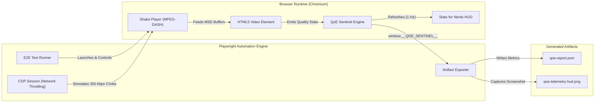
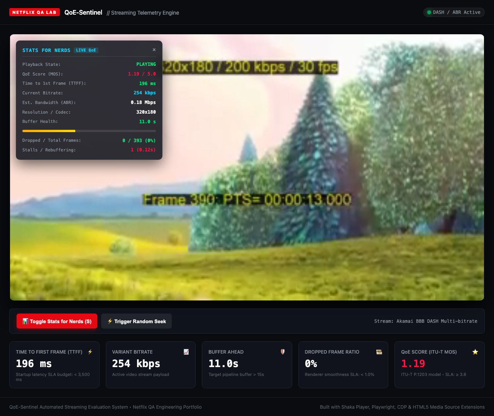

# 🎬 QoE-Sentinel: Autonomous Video Streaming QoE Test Framework

[](https://github.com/shaka-project/shaka-player)
[](https://playwright.dev/)
[](https://dashif.org/)
[](https://netflix.com)

> **Autonomous Quality of Experience (QoE) testing system for HTML5 adaptive video streaming.**  
> Built to evaluate video playback pipelines under real-world stress conditions: startup latency (TTFF), aggressive seeking ("Seek Hell"), and real-time Chrome DevTools Protocol (CDP) network throttling.

---

## 📌 Architecture & Design





---

## 🎯 Key Capabilities

1. **Google Shaka Player Integration**
   - Industrial-grade multi-bitrate MPEG-DASH playback engine.
   - Configured with proactive ABR adaptation and buffer management thresholds.

2. **Real-time "Stats for Nerds" Telemetry HUD**
   - Translucent glassmorphism overlay displaying live streaming health metrics.
   - Toggleable via UI button or keyboard shortcut (`S`).
   - Programmatic inspection interface via `window.__QOE_SENTINEL__.getSnapshot()`.

3. **Time to First Frame (TTFF) SLA Benchmark**
   - Precision measurement from manifest request start to initial decoded and rendered frame.
   - Enforces SLA performance budgets (< 3,500 ms target).

4. **"Seek Hell" Timeline Stress Testing**
   - Simulates erratic user timeline navigation (back-to-back seeks across buffered and unbuffered chunks).
   - Validates MediaSource pipeline resilience, prevents playback deadlock, and tracks re-buffering recovery.

5. **CDP (Chrome DevTools Protocol) Network Throttling**
   - Injects realistic network degradation (e.g., 350 kbps bandwidth constraint + 300ms RTT latency) directly at the browser transport layer.
   - Observes and evaluates Shaka Player ABR adaptation (downswitching stream variants to maintain playback continuity without terminal stall).

6. **"Tunnel Vision" Total Network Outage & Rebuffering Recovery SLA**
   - Simulates complete connection drops (`offline: true` for 6 seconds) mimicking subways, elevators, or cell handover failures.
   - Verifies player pipeline resilience through media buffer depletion and measures **Rebuffering Recovery Time (RRT)** upon network reconnection.

7. **ITU-T P.1203 Inspired MOS (Mean Opinion Score)**
   - Algorithmic viewer satisfaction model computing a normalized QoE score (1.0 – 5.0).
   - Factors in base video encoding quality, TTFF startup latency penalties, stall frequency/duration weights, and ABR switching instability.

8. **Automated Artifacts Generation**
   - Generates structured, timestamped JSON reports to `/artifacts/qoe-report.json`.
   - Captures high-resolution visual screenshots of the telemetry HUD under stress into `/artifacts/`.

---

## 📊 Core QoE Metrics Tracked

| Metric | Description | Target / SLA |
| :--- | :--- | :--- |
| **QoE Score (ITU-T MOS)** | Synthesized viewer experience index (1.0 to 5.0 scale) based on ITU-T P.1203. | `≥ 3.8 / 5.0` |
| **TTFF (Time to First Frame)** | Duration in milliseconds between stream initiation and the first rendered frame. | `< 3,500 ms` |
| **Rebuffering Recovery Time (RRT)** | Latency required to replenish buffer and resume smooth playback after an outage. | `< 6,000 ms` |
| **Buffer Health (Length)** | Amount of forward-buffered media (in seconds) stored ahead of current playhead. | `> 15.0 s` |
| **Variant Bitrate** | Bitrate of the active video representation chosen by the ABR engine. | Dynamic (e.g. 500 – 4500 kbps) |
| **Dropped Frame Ratio** | Ratio of dropped video frames to total decoded frames (`getVideoPlaybackQuality`). | `< 1.0 %` |
| **Stalls & Rebuffering** | Count of playback interruptions and accumulated freeze time (excluding intentional seeks). | `0 unexpected stalls` |
| **ABR Adaptation Speed** | Time taken by player to downswitch or upswitch representations upon throughput shifts. | `< 15.0 s` |

---

## 📁 Project Structure

```
QoE-Sentinel/
├── artifacts/                     # Generated test reports & screenshots
│   ├── qoe-report.json            # Machine-readable QoE benchmark metrics
│   ├── qoe-telemetry-hud.png      # High-res screenshot of live Stats for Nerds HUD
│   ├── baseline-playback-hud.png  # Baseline playback verification screenshot
│   ├── seek-hell-recovery-hud.png # Stress test recovery screenshot
│   └── offline-recovery-hud.png   # Network outage recovery screenshot
├── tests/
│   └── qoe-streaming.spec.js      # Playwright E2E QoE test suite
├── index.html                     # HTML5 streaming test stage with Shaka Player
├── player.js                      # QoE telemetry engine & Shaka Player logic
├── styles.css                     # Dark-mode streaming dashboard & HUD styles
├── playwright.config.js           # Playwright & local webServer configuration
├── package.json                   # Dependencies & automated scripts
└── README.md                      # Engineering documentation
```

---

## 🚀 Getting Started

### 1. Prerequisites
- **Node.js**: v18 or higher (v20+ recommended)
- **npm**: v9 or higher

### 2. Installation
```bash
git clone https://github.com/krzysztofrasala/QoE-Sentinel.git
cd QoE-Sentinel
npm install
```

### 3. Running Automated QoE Tests
Run the full headless suite:
```bash
npm test
```

Run tests in headed mode to watch the player and HUD in real time:
```bash
npm run test:headed
```

View the generated Playwright HTML execution report:
```bash
npm run test:report
```

### 4. Running the Interactive Web Player
Start the local server and open your browser:
```bash
npm start
```
Navigate to: `http://localhost:3000`
- Press **`S`** to toggle the "Stats for Nerds" overlay.
- Click **Trigger Random Seek** to manually test pipeline recovery.

---

## 📈 Sample Generated QoE Report (`/artifacts/qoe-report.json`)

```json
{
  "testRunTimestamp": "2026-09-20T19:05:00.000Z",
  "generator": "QoE-Sentinel Automated Streaming Benchmark",
  "qoeMetricsSummary": {
    "timeToFirstFrameMs": 1420,
    "ttffBudgetSLA": "< 3500 ms",
    "ttffPass": true,
    "mosScore": 4.17,
    "mosScoreTargetSLA": ">= 3.8",
    "droppedFrames": 0,
    "totalFrames": 412,
    "droppedFrameRatioPercent": 0,
    "stallsCount": 0,
    "totalStallDurationSec": 0,
    "finalBufferLengthSec": 24.8,
    "finalResolution": "1280x720",
    "finalBitrateKbps": 2240
  },
  "stressTestResults": {
    "seekHellSurvives": true,
    "networkThrottlingObserved": true,
    "preThrottleBitrateKbps": 2240,
    "postThrottleBitrateKbps": 490
  }
}
```

---

## 🧪 Netflix QA Engineering Context

In large-scale streaming systems (like Netflix, Prime Video, or YouTube), video playback quality isn't just about UI layout or buttons. It's about **playback continuity**, **audio-video synchronization**, and **client-side QoE telemetry**.

This project demonstrates:
- Deep familiarity with **HTML5 Media Source Extensions (MSE)** and adaptive streaming protocols (**MPEG-DASH / HLS**).
- Direct utilization of **Chrome DevTools Protocol (CDP)** for low-level transport simulation.
- Robust stress testing against pipeline edge cases (**Buffer under-run, Seek churn, Bandwidth collapse**).
- Production-grade observability via **Stats for Nerds HUD** and structured JSON metric pipelines for CI/CD regression tracking.

---

## 📄 License
MIT License. Created for Video Quality of Experience (QoE) test automation portfolio.
